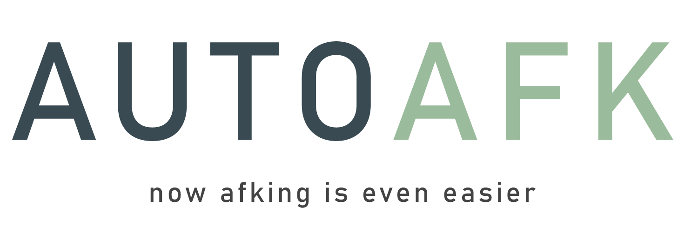
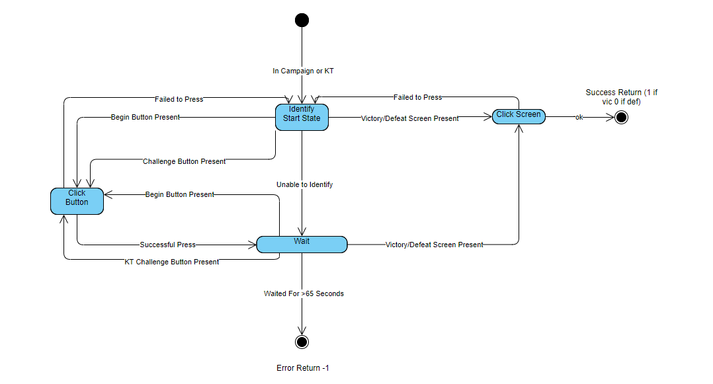

## What is AutoAfk?
AutoAfk is a tool written in Python which automates stage retrying in both the main campaign mode and King's Tower in the mobile game Afk Arena. It is intended to be run alongside a BlueStacks instance.

## Disclaimer
AutoAfk relies on pyautogui to handle image recognition which makes the script very sensitive to changes in the size of the BlueStacks instance. The script is designed to run best when the AfkArena window is 480x780 pixels. Since some uncertainty handling is built into the script, you can likely just mess around with your window size until the script starts working consistently. 

While AutoAfk can handle many "disruptions" to the normal stage retrying process, AutoAfk is currently unable to handle promotional offers being displayed after level completes. This is only a minor issue in the early game where these promotions are most common.

## Table of Contents
- [Design](#design)
- [How To Use](#how-to-use)
- [Dependencies](#dependencies)
- [Will I get banned in the game for using this?](#will-i-get-banned-in-the-game-for-using-this)
- [FAQ](#faq)

## Design
The program is designed roughly as pictured below as a finite state machine. The diagram is not a perfect representation of how the program works, but it is a close enough representation of the inner-workings to get a sense of what's going on under the hood.



## How To Use
To use AutoAfk, simply start up your preferred android emulator (BlueStacks is recommended) and then run AutoAfk.py. Make sure you have navigated to the campaign screen or to King's Tower. If nothing happens after 20 seconds of waiting, try making a small adjustment to the window size and then waiting again. Once the program is able to recognize the on-screen elements it is looking for (begin battle buttons, victory screen, etc.) it will take over the mouse and perform a series of clicks to initiate a battle. 

AutoAfk will continue to retry stages until the application is closed. In addition, if AutoAfk will output a message to the console after passing a difficult stage indicating how many retries it took before a victory. 

## Dependencies
* pyautogui 
* time

AutoAfk relies on pyautogui to handle on-screen element identification. Pyautogui can be installed by using pip ```pip install pyautogui``` while the time package is included in most versions of Python.

## Will I get banned in the game for using this?
Lilith has never been clear on whether the use of scripts is against their TOS or not. In one instance on reddit, a user reported that a customer service rep told them that using BlueStacks macros was allowed. This is consistent with Lilith's business model, as they primarily profit from PvP and whales. Your campaign progress does little to hurt their profits. I have also used this program on a new account for over a week without any issues. It's also an open secret that many players use BlueStacks macros and none of them have reported a ban. With that said, **use at your own risk**.

## FAQ
#### AutoAfk is not working no matter what size I make my android emulator
If you're using a dual monitor setup, make sure the android emulator is on your primary monitor.
